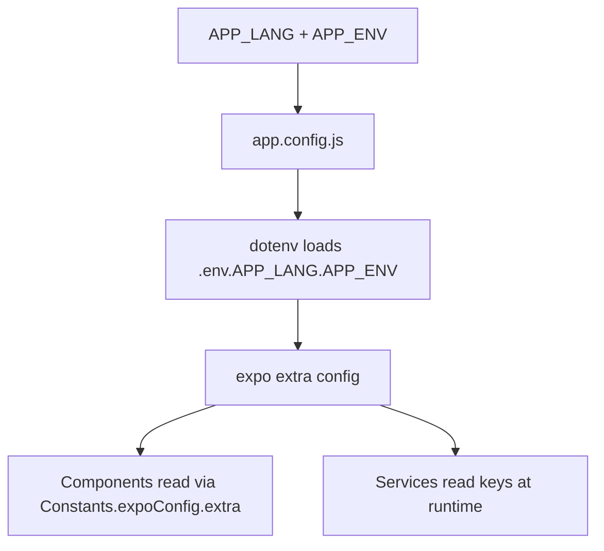

# 🏗️ Multi-Client Architecture Reference

Quick reference for the multi-client architecture of the Gita app.

---

## How It Works

The app uses **build-time client selection** via the `APP_LANG` environment variable. Each build bundles only one language's data.

```
APP_LANG=hi  →  .env.hi.production  →  app.config.js reads env
                                    →  Hindi app name, package ID
                                    →  Hindi ad IDs, Supabase, RevenueCat
                                    →  assets/Data/hi/ bundled
                                    →  i18n/translations/hi.json loaded
```

---

## Key Files

| File | Purpose |
|------|---------|
| `.env.<lang>.<env>` | Client-specific secrets & config |
| `.env.example` | Template for new env files |
| `app.config.js` | Loads env file, builds Expo config |
| `src/config/clientConfig.ts` | Client metadata registry (name, font, etc.) |
| `assets/Data/index.ts` | Resolves chapter data by language |
| `assets/Data/<lang>/` | 18 chapter JSON files per language |
| `src/lib/i18n/index.ts` | i18n setup, loads correct translation |
| `src/lib/i18n/translations/<lang>.json` | UI strings for each language |
| `eas.json` | EAS build profiles per language |
| `build-production.sh` | Production build helper script |

---

## Environment Variable Flow



### Key env vars read by the app:

| Env Var | Used By |
|---------|---------|
| `APP_LANG` | `app.config.js`, `eas.json` |
| `APP_NAME` | `app.config.js` → app display name |
| `APP_PACKAGE` | `app.config.js` → Android package |
| `APP_BUNDLE_ID` | `app.config.js` → iOS bundle ID |
| `BANNER_AD_UNIT_ID` | `app.config.js` → `extra` → ad service |
| `INTERSTITIAL_AD_UNIT_ID` | `app.config.js` → `extra` → ad service |
| `SUPABASE_URL` | `app.config.js` → `extra` → `supabaseClient.ts` |
| `SUPABASE_ANON_KEY` | `app.config.js` → `extra` → `supabaseClient.ts` |
| `REVENUECAT_*_API_KEY` | `app.config.js` → `extra` → `revenuecat.ts` |
| `EAS_PROJECT_ID` | `app.config.js` → `extra.eas.projectId` |

---

## Data Layer

Chapter data lives in `assets/Data/<lang>/chapterN.json`.

The resolver (`assets/Data/index.ts`) uses the language from `Constants.expoConfig.extra.LANGUAGE` to pick the correct data array:

```typescript
const lang = Constants.expoConfig?.extra?.LANGUAGE || 'bn';
export const rawChapters = chaptersByLang[lang] ?? chaptersByLang.bn;
```

Stores (`chapterStore.ts`, `translationStore.ts`) import `rawChapters` and are **language-agnostic** — they don't need any changes per client.

---

## i18n System

Uses `i18n-js` library. Translation files are per-language JSON in `src/lib/i18n/translations/`.

```typescript
// src/lib/i18n/index.ts
const lang = Constants.expoConfig?.extra?.LANGUAGE || 'bn';
i18n.locale = lang;
i18n.enableFallback = true;   // falls back to Bengali if key missing
i18n.defaultLocale = 'bn';
```

---

## Build Commands

| Command | What it does |
|---------|-------------|
| `npm run start:bn` | Dev server for Bengali |
| `npm run start:hi` | Dev server for Hindi |
| `eas build --profile bn` | Production APK for Bengali |
| `eas build --profile hi` | Production APK for Hindi |
| `./build-production.sh hi` | Interactive production build for Hindi |

---

## Current Clients

| Code | Language | App Name | Status |
|------|----------|----------|--------|
| `bn` | Bengali | গীতা বাংলা | ✅ Active |
| `hi` | Hindi | गीता हिंदी | 📋 Planned |
| `en` | English | Bhagavad Gita | 📋 Planned |
| `or` | Odia | ଗୀତା ଓଡ଼ିଆ | 📋 Planned |
| `as` | Assamese | গীতা অসমীয়া | 📋 Planned |

---

## Folder Structure

```
gita/
├── .env.bn.development          ← per-client env files
├── .env.bn.production
├── .env.example                 ← template
├── app.config.js                ← reads APP_LANG, loads env
├── eas.json                     ← build profiles per lang
├── package.json                 ← convenience scripts
├── build-production.sh          ← production build helper
├── assets/
│   ├── Data/
│   │   ├── bn/                  ← Bengali chapter data (18 files)
│   │   ├── hi/                  ← Hindi (when added)
│   │   └── index.ts             ← data resolver
│   └── fonts/
│       ├── primary.ttf          ← regional font
│       ├── secondary.ttf
│       └── english.ttf
├── src/
│   ├── config/
│   │   └── clientConfig.ts      ← client metadata registry
│   ├── lib/
│   │   └── i18n/
│   │       ├── index.ts         ← i18n setup
│   │       └── translations/
│   │           ├── bn.json      ← Bengali UI strings
│   │           └── hi.json      ← Hindi (when added)
│   ├── services/
│   │   ├── supabaseClient.ts    ← reads keys from env
│   │   └── revenuecat.ts        ← reads keys from env
│   └── store/
│       ├── chapterStore.ts      ← language-agnostic
│       └── translationStore.ts  ← language-agnostic
└── docs/                        ← you are here
    ├── NEW_CLIENT_GUIDE.md
    ├── NEW_CLIENT_CHECKLIST.md
    └── ARCHITECTURE.md
```
