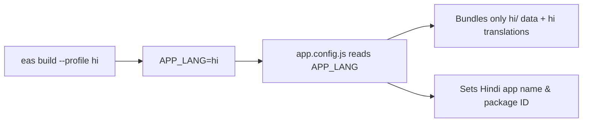

# 📖 Adding a New Language Client — Step-by-Step Guide

This guide walks you through adding a new language client (e.g., Hindi, English, Odia) to the Gita app.
The app uses a **build-time client selection** architecture — each APK ships only its own language data (~625 KB), keeping app size constant.

---

## Architecture Overview

```
APP_LANG env var → app.config.js → loads .env.<lang>.<env>
                                  → sets app name, package ID, ad IDs, etc.
                                  → assets/Data/<lang>/ chapter data bundled
                                  → src/lib/i18n/translations/<lang>.json loaded
```



> [!IMPORTANT]
> Each build only ships **one language's data**. Adding Hindi data to the repo does **not** increase the Bengali APK size.

---

## Step 1 — Create Environment Files

Create two `.env` files in the project root:

### `.env.<lang>.development`
### `.env.<lang>.production`

Copy from `.env.example` and fill in client-specific values:

```env
# Client Identity
APP_LANG=hi                              # ← your language code
APP_NAME=गीता हिंदी                       # ← app name in target language
APP_PACKAGE=com.proninja.bhagavad_gita_hindi  # ← unique Android package ID
APP_BUNDLE_ID=com.proninja.bhagavad-gita-hindi # ← unique iOS bundle ID

# AdMob — get new IDs from AdMob console
ADMOB_ANDROID_APP_ID=ca-app-pub-xxx~xxx
ADMOB_IOS_APP_ID=ca-app-pub-xxx~xxx
BANNER_AD_UNIT_ID=ca-app-pub-xxx/xxx
INTERSTITIAL_AD_UNIT_ID=ca-app-pub-xxx/xxx
REWARDED_AD_UNIT_ID=ca-app-pub-xxx/xxx
REWARDED_INTERSTITIAL_AD_UNIT_ID=ca-app-pub-xxx/xxx

# Supabase — can share or create new project
SUPABASE_URL=https://xxx.supabase.co
SUPABASE_ANON_KEY=xxx

# RevenueCat — create new project in RevenueCat dashboard
REVENUECAT_ANDROID_API_KEY=xxx
REVENUECAT_IOS_API_KEY=xxx

# EAS — create new project: eas init
EAS_PROJECT_ID=xxxx-xxxx-xxxx
```

> [!TIP]
> For development, use test AdMob IDs, test RevenueCat keys, and a staging Supabase project.

### Keys you need to obtain:

| Key | Where to get it |
|-----|----------------|
| `APP_PACKAGE` / `APP_BUNDLE_ID` | Choose unique IDs for Play Store / App Store |
| `ADMOB_*` IDs | [AdMob Console](https://admob.google.com) — create a new app |
| `SUPABASE_URL` / `SUPABASE_ANON_KEY` | [Supabase Dashboard](https://supabase.com) — create or reuse project |
| `REVENUECAT_*` keys | [RevenueCat Dashboard](https://app.revenuecat.com) — create new project |
| `EAS_PROJECT_ID` | Run `eas init` in the project |

---

## Step 2 — Add Chapter Data (18 JSON files)

Create the folder `assets/Data/<lang>/` with 18 chapter files:

```
assets/Data/
├── bn/              ← existing Bengali
│   ├── chapter1.json
│   └── ... (18 files)
├── hi/              ← NEW: Hindi
│   ├── chapter1.json
│   ├── chapter2.json
│   └── ... (chapter18.json)
```

### Chapter JSON Format

Each chapter file must follow this exact structure:

```json
{
  "chapter": {
    "number": "१",              // chapter number in target script
    "title": "प्रथम अध्याय",    // chapter title in target language
    "subtitle": "अर्जुन विषाद योग", // subtitle in target language
    "englishTitle": "Arjuna Vishada Yoga",  // keep English
    "totalVerses": "४७",        // total verses in target script
    "description": "...",       // description in target language
    "id": "sb7f0K9D"            // keep same ID as Bengali
  },
  "dedication": {
    "Language": "...",          // dedication text in target language
    "meaning": "..."           // English meaning (keep same)
  },
  "verses": [
    {
      "verseNumber": "१",       // verse number in target script
      "Language": "...",        // verse text (Sanskrit/target transliteration)
      "translation": "...",     // translation in target language
      "speaker": "...",         // speaker name in target language
      "id": "BjPtMVmx",        // keep same ID as Bengali
      "speaker_english": "Dhritarashtra"  // keep English
    }
  ],
  "summary": {
    "title": "...",             // chapter summary title
    "description": "...",       // chapter summary
    "keyThemes": ["...", "..."] // key themes in target language
  },
  "metadata": {
    "source": "...",            // source URL
    "language": "हिंदी",        // language name in target language
    "scripture": "...",         // scripture name in target language
    "chapterType": "...",
    "totalWords": "...",
    "lastUpdated": "2024"
  }
}
```

> [!CAUTION]
> Keep the `id` fields **identical** across all languages. They are used for bookmarks, favorites, progress tracking, and cross-language data linking.

---

## Step 3 — Register Data in the Data Resolver

**File:** `assets/Data/index.ts`

Add your language's chapter imports:

```typescript
// Add this block (uncomment pattern):
const hiChapters = [
    require('./hi/chapter1.json'),
    require('./hi/chapter2.json'),
    // ... all 18 chapters
    require('./hi/chapter18.json'),
];

// Add to the chaptersByLang map:
const chaptersByLang: Record<string, any[]> = {
    bn: bnChapters,
    hi: hiChapters,    // ← ADD THIS
    // en: enChapters,
};
```

---

## Step 4 — Add UI Translations

**File:** `src/lib/i18n/translations/<lang>.json`

Create a translations file for your language. Copy the structure from `bn.json` and translate all string values.

The file has these top-level sections:
- `home` — Home screen texts
- `onboarding` — Onboarding slides
- `mangalacharan` — Prayer texts
- `dhyana` — Meditation texts
- `gitaMahatmya` — Gita Mahatmya texts
- `gitaSummary` — Chapter summaries
- `menu` — Menu items
- `common` — Common UI strings (back, next, save, etc.)
- `bookmark` — Bookmark feature strings
- `favorite` — Favorites feature strings
- `share` — Share feature strings
- `search` — Search feature strings
- `chapter` — Chapter list screen
- `verse` — Verse display
- `progress` — Reading progress
- `theme` — Theme toggle
- `profile` — Settings screen
- `pro` — Pro/Premium features
- `subscription` — Subscription screen
- `tabs` — Bottom tab names
- `translations` — Translation screen
- `speakers` — Speaker names
- `malaJapa` — Mala Japa feature
- `krishnaMantras` — Krishna Mantras
- `dailyReading` — Daily Reading feature

Then register it in `src/lib/i18n/index.ts`:

```typescript
import hi from './translations/hi.json';
// ...

const translations: Record<string, any> = {
    bn,
    hi,    // ← ADD THIS
};
```

---

## Step 5 — Register Client Config

**File:** `src/config/clientConfig.ts`

Add your language to the `CLIENTS` map:

```typescript
const CLIENTS: Record<string, ClientConfig> = {
    bn: { ... },
    hi: {                                    // ← ADD THIS BLOCK
        lang: 'hi',
        appName: 'गीता हिंदी',
        fontFamily: 'NotoSerifDevanagari',   // see Font Guide below
        scriptDirection: 'ltr',
    },
};
```

### Font Family Reference

| Language | Script | Font Family |
|----------|--------|-------------|
| Bengali (bn) | বাংলা | `NotoSerifBengali` |
| Hindi (hi) | देवनागरी | `NotoSerifDevanagari` |
| English (en) | Latin | `NotoSerif` |
| Odia (or) | ଓଡ଼ିଆ | `NotoSerifOriya` |
| Assamese (as) | অসমীয়া | `NotoSerifBengali` (shares Bengali script) |

> [!NOTE]
> If your language needs a new font, add the `.ttf` file to `assets/fonts/` and register it in `app.config.js` or via `expo-font`.

---

## Step 6 — Add EAS Build Profile

**File:** `eas.json`

Add a new build profile for your language:

```json
{
  "build": {
    "hi": {
      "extends": "production",
      "env": {
        "APP_LANG": "hi",
        "APP_ENV": "production"
      },
      "channel": "hi",
      "android": {
        "buildType": "apk"
      }
    }
  }
}
```

---

## Step 7 — Add npm Scripts

**File:** `package.json`

Add convenience scripts:

```json
{
  "scripts": {
    "start:hi": "APP_LANG=hi APP_ENV=development expo start",
    "android:hi": "APP_LANG=hi APP_ENV=development expo run:android",
    "prebuild:android:hi": "APP_LANG=hi APP_ENV=development expo prebuild --platform android --clean"
  }
}
```

---

## Step 8 — Add Firebase Config (if separate project)

If using a separate Firebase project per language:

1. Download `google-services.json` from Firebase Console
2. Place it at the project root (or use per-client path in `app.config.js`)
3. Update `firebase.json` if needed

> [!TIP]
> For initial testing, you can share the existing Firebase project. Create separate projects when the client is ready for production.

---

## Step 9 — Test Locally

```bash
# Start dev server with new language
npm run start:hi

# Or explicitly:
APP_LANG=hi APP_ENV=development npx expo start

# Build Android locally:
npm run android:hi
```

### Verify:
- [ ] App name shows in target language
- [ ] Chapter data loads on the Chapters screen
- [ ] UI strings appear in target language throughout
- [ ] Bookmarks and favorites work
- [ ] Search works with target language text
- [ ] Share feature shows correct language text

---

## Step 10 — Production Build

```bash
# Build APK with EAS
eas build --profile hi --platform android

# Or use the build script:
./build-production.sh hi
```

---

## Complete File Checklist

| # | File | Action | Required |
|---|------|--------|----------|
| 1 | `.env.<lang>.development` | CREATE | ✅ |
| 2 | `.env.<lang>.production` | CREATE | ✅ |
| 3 | `assets/Data/<lang>/chapter1.json` ... `chapter18.json` | CREATE (18 files) | ✅ |
| 4 | `assets/Data/index.ts` | MODIFY — add chapter imports | ✅ |
| 5 | `src/lib/i18n/translations/<lang>.json` | CREATE | ✅ |
| 6 | `src/lib/i18n/index.ts` | MODIFY — import & register | ✅ |
| 7 | `src/config/clientConfig.ts` | MODIFY — add to CLIENTS map | ✅ |
| 8 | `eas.json` | MODIFY — add build profile | ✅ |
| 9 | `package.json` | MODIFY — add npm scripts | Optional |
| 10 | `assets/fonts/<font>.ttf` | CREATE (if new script) | If needed |
| 11 | `google-services.json` | REPLACE (if separate Firebase) | If needed |

---

## Frequently Asked Questions

### Q: Will adding a new language increase the existing app size?
**No.** Each APK only bundles the chapter data and translations for its own language.

### Q: Can multiple languages share the same Supabase/Firebase project?
**Yes.** For development and small-scale apps, sharing is fine. For production with different user bases, separate projects are recommended.

### Q: What if I need RTL support?
Set `scriptDirection: 'rtl'` in `clientConfig.ts`. The app reads this from the client config.

### Q: Do I need to change any component code?
**No.** The architecture is designed so that components automatically read from the active client config. All you need is data + translations + config entries.
